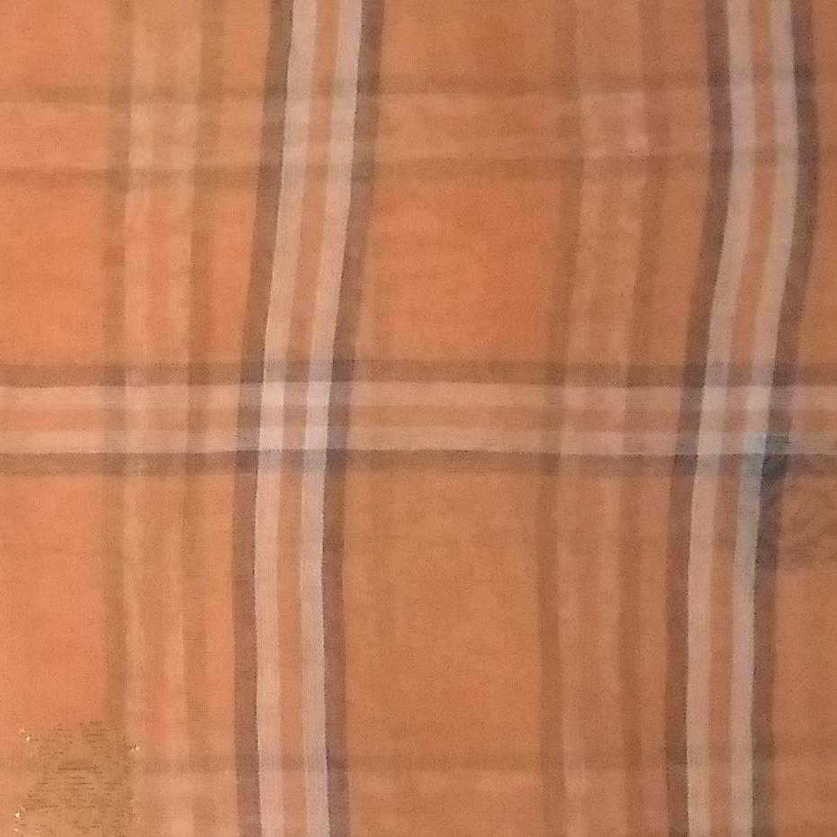
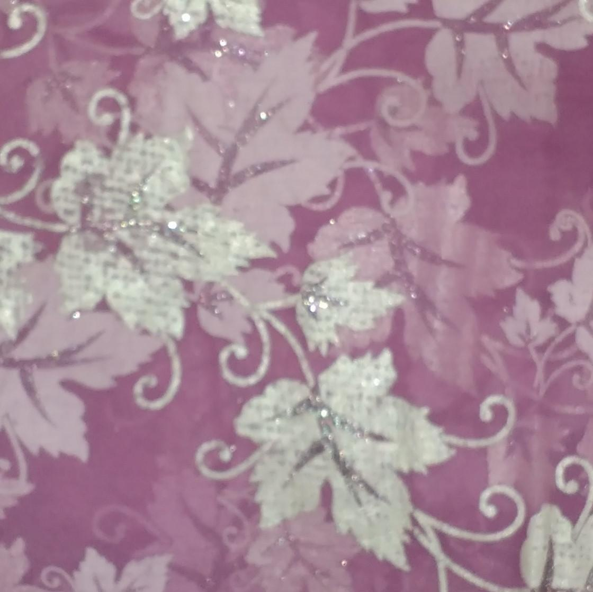
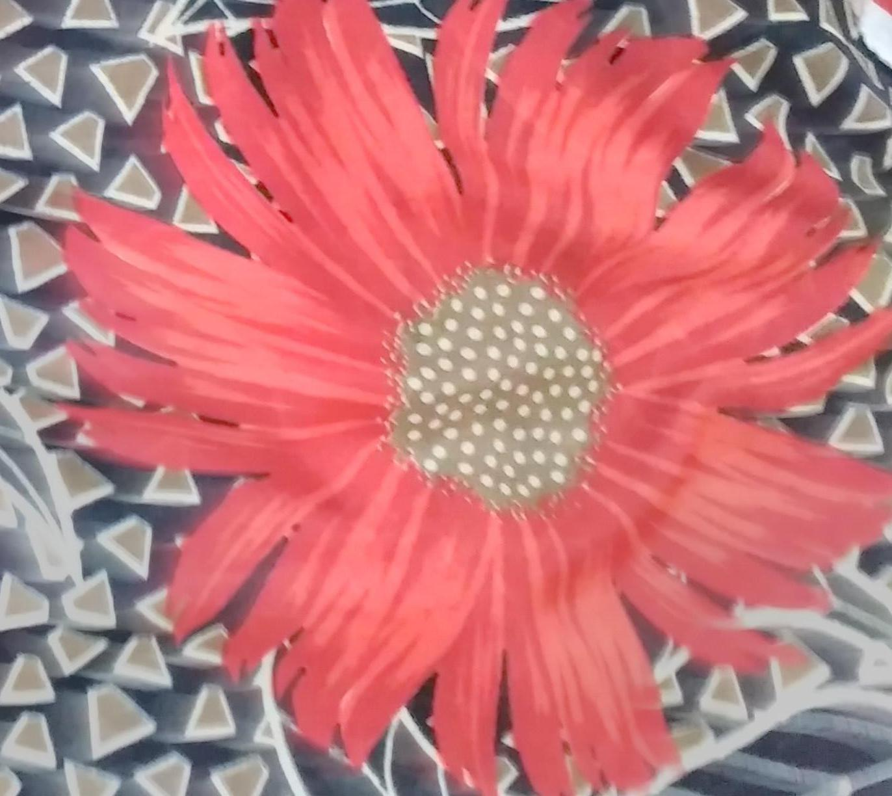
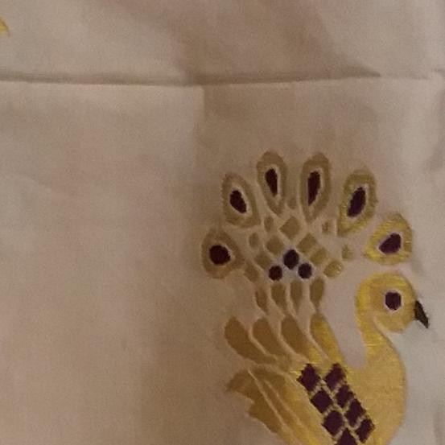
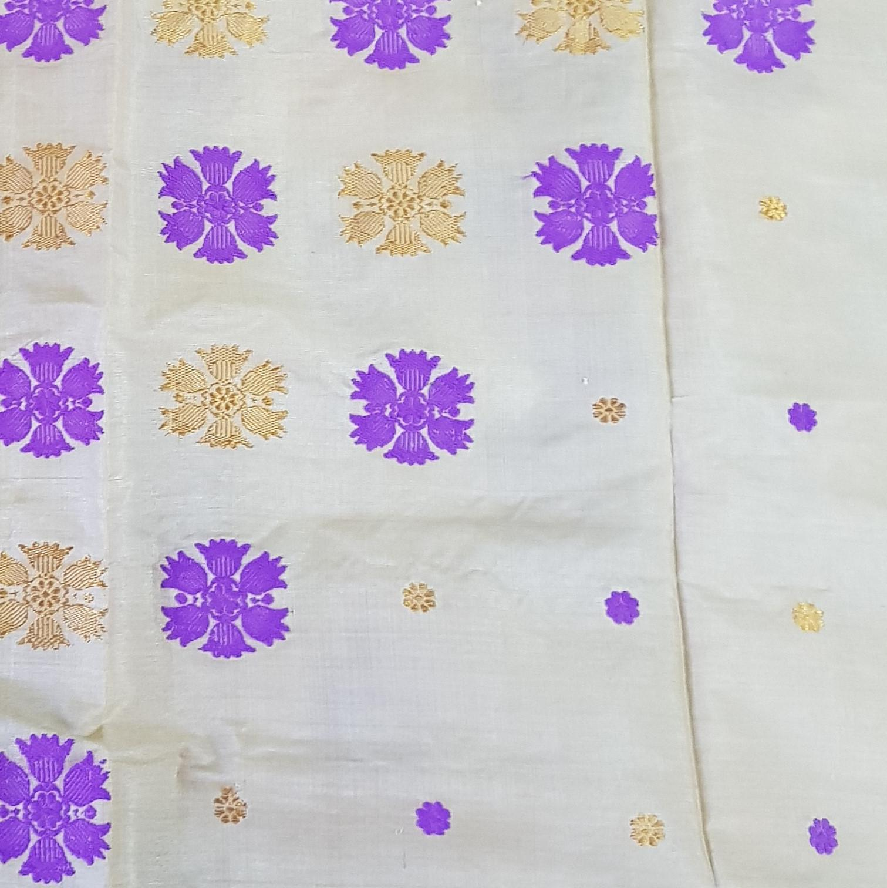

  [](https://github.com/dwyl/esta/issues) 
# Handloom-Design-Generation-using-Deep-Neural-Networks-
This is our 4th year Engineering final year project. It aims to use techniques like Conditional GAN , Image to Image translation , Texture and content transfer for aiding as a design tool for handloom weavers and also designers and industry as a whole. 

### How to use the data_builder  
```
$ python data_builder.py -h
usage: data_builder.py [-h] --tfx TARGET_FOLDERX --tfy TARGET_FOLDERY
                       [--augx AUGMENTX] [--augy AUGMENTY]

data builder

optional arguments:
  -h, --help            show this help message and exit
  --tfx TARGET_FOLDERX
  --tfy TARGET_FOLDERY
  --augx AUGMENTX
  --augy AUGMENTY

```  

Run the the script at any target folder to create a dataset out of all the images inside the folder. Augmentation of image includes current colour shifting and inverting of axis and both combined. Each of the script uses a similar data builder method. You can also use the batchwise data builder for the Perceptual and GAN scripts.  

# Dataset  

We collected a complete orignal set of dataset for this purpose. Collected over 500 sarees' images where we randomly cropped to get 5 patches of design. These patches were then augmented to give us more number of dataset which is very much required for the GANs. 

The dataset comprises of two collections of images - normal sarees and handloom sarees. The exact details about the collections are stated below.

<div>
  <div>
    <h4>Normal sarees</h4>
      	
	
	
	
      	
	
	
	
	
	
	
	
	
	
  </div><br>
  <div>
    <h4>Handloom sarees</h4>
      	
	
	
	
      	
	
	
	
	
	
	
	
	
	
  </div>
</div>
<br><br>
<strong>Normal Sarees</strong>
<ul>
  <li>Number of Images: 580</li>
  <li>Number of Images (after crop): 2900</li>
  <li>Number of Images (after augmentation): 26100</li>
  <li>Image Resolution: 256 X 256 X 3</li>
  <li>Image Format: RGB - JPG/JPEG</li>
  <li>Size of Collection: 200 MB</li>
</ul>

<strong>Handloom Sarees</strong>
<ul>
  <li>Number of Images: 33</li>
  <li>Number of Images (after crop): 165</li>
  <li>Number of Images (after augmentation): 1185</li>
  <li>Image Resolution: 256 X 256 X 3</li>
  <li>Image Format: RGB - JPG/JPEG</li>
  <li>Size of Collection: 18 MB</li>
</ul>

The dataset can be downloaded from <a target="_blank" href="https://drive.google.com/open?id=1V_DcXJ50QYV9nEqvq7fqKno_lhbSPdBM">here</a>. New images are being included to the dataset.

# Methodologies

## 1. Simple GAN 

Attempt at achieving simple designs using very low amount of data of Meckala Sador dataset and also Saree Dataset.  
**Results :** The DCGAN was not able to generate higher resolution images. We targeted for atleast 512x512 or 256x256 . The results were taking to long on a single P100 GPU. (GCP virtual machine GPU)

## 2. Variation AutoEncoder 

A simple attempt at genrative model to using very low amount of data for generating design after learning from Saree dataset. To be quoted "Miserable results" is what we we got. more updates on the methods later on but the very early version is not working.
**Results:** Similar to what the DCGAN gave.

## 3. Fast Neural Style Transfer using Perceptual loss  
This will work as a image inpaniting method of various cases of probelm.

Credits: [fast-neural-style-keras](https://github.com/misgod/fast-neural-style-keras)  
The final models are from this particular scripts since, the model here was not showing any window artifact i.e having a kind of padded window to the right side of the image of the same pattern otherwise both the scripts from this and ours can be used for style transfer. 

The notebooks inside the repo of fast-neural-style-transfer is for the inference and testing of single image. Try those notebook if you do not want to deploy the full application.  

If you want to retrain running the `` train.py `` or the ``train.sh`` (in case of prelim work scripts) will do the job. The shell script is configurable.  

When trying fast neural style transfer the network was trained using MS-COCO validation dataset which is smaller than the actual dataset. The results are in the location "preliminary work/Perceptual Loss Style transfer - rajat/Final Result from the 2nd script/"  


## 4. Image to Image translation problem i.e Pix2Pix

We treat generating handloom design as an image to image translation problem where take normal saree dataset will be treated as the input image and the Mekhala dataset as the target distribution which the normal dataset must be converted to. This can be tackled by following  
### CycleGAN  
<div>
	
	
</div>
<br />
<div>
	
	
</div>
<br />
<div>
	
	
</div>
### DiscoGAN  
to be updated


# App demo  

This is the final application which shows how Neural Style tranfer can be employed into designing saree patches. Such patches can then be used as design suggestion for the rest of saree body.

link: [neural-loom-app , style transfer demo](https://imgur.com/a/WbVoV3M)  

The original plan was though to deploy the models in the front end but the fast style transfer model computation took too much time on CPU so we refrained from something like that. Still if possible I will look for free alternative that will atleast allow us to host the app and the model together for free. Firebase ML toolkit or google cloud ml engine maybe options.

# Installation & Deployment  

You will need these preinstalled on your server for both Perceptual Style Transfer and DiscoGAN (script is similar but the server are sepparated , since DISCOGAN is too large to deploy on one single GPU)
* Python3
* Numpy
* Matplotlib
* OpenCV
* tensorflow with keras api (we are using the Keras api sepparately not the only available in tf)

for deploying in the server set your port in the script app.py located in neural-loom-server folder  

``
python app.py
``  


Should do the job. Things to consider  
* If deploying on containers or virtual machine instances make sure Firewall is allowing the traffic through the particular port you are using. We were misconfuguring a lot of times , resulting in wastage of time.  
* The native CORS for flask failed in our usecase for some reason unexplainable. So we resorted to manually appending the headers. 
* The **DISCOGAN** and **PERCEPTUAL NEURAL STYLE** both are to be hosted in sepparate servers hence have sepparate server scripts

For the front end you need npm. So install  
* node and npm (they come together for windows for linux may need to install separtely in some distributions)  

In the neural-loom-app , go to the services and then to upload.service.ts , there edit the ip address according to your setup.   

``
ng build --prod
``  
Will give you the html , css and js files. Deploy them accordingly. Using flask or http-server (npm app for deploying html project quickly)  

**hardware:** We deployed on Google Cloud platform VM with Nvidia P100 GPU 16GB VRAM, i5 4 core , 16GB RAM. The client can be any simple rustbucket.


### Todo  
* ~~add option for resolution change~~
* ~~Find proper paramters for Faste Neural Style transfer for global learning~~
* ~~Use natural images and artistic image to train Network, Use the network to appy style on existing Saree (Normal and Mekhala data)~~  
* ~~Use saree data to train to apply style and color of Mekhala dataset on the normal saree dataset~~
* ~~Use artistic dataset to train , and use masking technique on hand drawn image for Image-inpainting~~
* ~~Use Mekhala sador dataset for image inpainting~~
* ~~Test CycleGAN on normal dataset prepare a testing script for our experiments~~  
* ~~Test DiscoGAN on normal dataset prepare a testing script for our experiments~~
* ~~Test both network for domain transfer~~
* ~~make web based pipeline for all operation~~
* ~~make python server for getting image and serving the processed image back~~
* ~~make frontend Angular application~~
* ~~have the python server interact with the model.predict to get output~~
* Finish the README.  

Contrib: [Meghali Nandi](https://github.com/Meghali-Nandi) , [Amrit Jha](https://github.com/amritjha)
